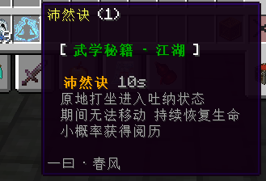

# 打坐挂机功能

## 预期效果



## 分析

1. 释放技能后进入 打坐状态
2. 打坐状态移动退出打坐状态
3. 打坐状态回血
4. 打坐状态有概率增加经验

## 代码实现

```kotlin
object PeiRanJue : AbstractSkill {

    @Awake(LifeCycle.ACTIVE)
    fun load() {
        register()
    }

    override val name: String = "沛然诀"

    override val type: String = "ALL"

    // 这一步让有Buff的就无法释放技能（虽然释放了也没BUG)
    override fun onCondition(livingEntity: LivingEntity, level: Int): Boolean {
        return BuffManager.getBuff(livingEntity, "沛然诀_纳元") == 0
    }

    // 技能冷却
    override fun getCooldown(livingEntity: LivingEntity, level: Int): Long {
        return 20 * 10
    }

    // 进入打坐状态 增加Buff
    override fun onRun(livingEntity: LivingEntity, level: Int): Boolean {
        BuffManager.add(livingEntity, "沛然诀_纳元", 1, 20 * 10, livingEntity.uniqueId)
        return true
    }

}


//注册打坐Buff
object PeiRanJueBuff : AbstractBuff {

    override val icon: Material = Material.FIRE
    override val id: String = "沛然诀_纳元"
    override val info: String = "吸纳天地灵气"
    override val name: String = "沛然诀·纳元"

    @Awake(LifeCycle.ACTIVE)
    fun load() {
        register()
    }

    // 坐标记录
    val locMap = ConcurrentHashMap<UUID, Location>()
    
    // 打坐次数记录 因为我想让他最快10秒才可以增加一次经验
    val amount = ConcurrentHashMap<UUID, Int>()

    // 在获得Buff时 添加到loc坐标记录
    override fun onJoin(target: LivingEntity, level: Int, time: Long, from: UUID): Boolean {
        locMap.getOrPut(target.uniqueId) { target.location }
        return super.onJoin(target, level, time, from)
    }

    // 开始每Tick的判断
    override fun onTick(target: LivingEntity, level: Int, time: Long, from: UUID): Boolean {
        val location = locMap[target.uniqueId] ?: return true
        //如果当前坐标和记录坐标不一致 则移除Buff
        if (location.distance(target.location) > 1.0) {
            locMap.remove(target.uniqueId)
            BuffManager.clearBuff(target, id)
            target.info("因为移动结束了 沛然诀·纳元 ")
            return false
        }
        // 回血
        Damage.heal(target, target, 1.0)
        
        // 判断计数器 
        val am = amount.getOrPut(target.uniqueId) { 0 }
        amount[target.uniqueId] = am + 1
        // 满足条件增加经验
        if (am >= 10) {
            
            // 有25%概率增加经验
            if (Random.nextDouble() < 0.25) {
                val player = target as? Player ?: return false
                val levelP = (1..(player.level / 2) + 1).random()
                LevelBar.addExp(player, levelP)
                player.info("§a+ §e${levelP}§a 阅历")
                amount[target.uniqueId] = 0
            }
        }
        // 设置当前Buff剩余时间为10秒 (显示出来的是9s 会扣除本次耗时)
        BuffManager.getData(target, id)?.let {
            it.overtime = System.currentTimeMillis() + 10000
        }
        return super.onTick(target, level, time, from)
    }

}


```
